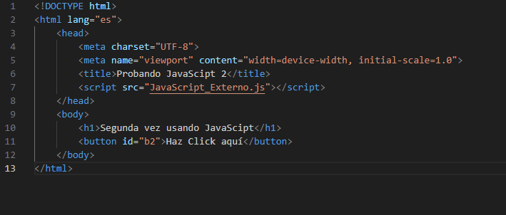
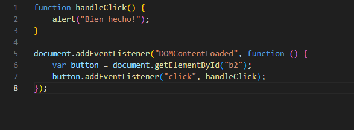

# Proyecto 1

## Modelos de Programación en Entornos Cliente/Servidor

### Investigación de los modelos cliente/servidor más comunes.

Las arquitecturas de cliente/servidor son :

- Arquitectura de 2 Capas
- Arquitectura de 3 Capas
- Arquitectura de N Capas

#### **Arquitectura de 2 Capas**

Se utiliza para describir los sistemas c/s , el cliente solicita recursos o información al servidor y este responde con sus respectivos recursos e infromación . Por lo tanto , el servidor no necesita de una aplicación extra para proporcionar un parte de ese servicio .

#### **Arquitectura de 3 Capas**

Hace prácticamente lo mismo que el de 2 Capas ,solo que necesita una capa intermedia denominada software intermedio cuya labor es proporcionar los recursos solicitados por el cliente pero necesita de otro servidor para hacerlo . La última capa es el servidor que proporciona los recursos o datos al servidor de aplicaciones .

#### **Arquitectura de N Capas**

Como vemos en la Arquitectutra de 3 Capas , los servidores o capas 2 y 3 tienen una tarea específica por lo tanto tanto un servidore web puede usar los servicios de otros servidores para proporcionar el servicio solicitado . Con esto entendemos que este modelo de cliente/servidor puede estar compuesto por N servidores donde cada uno brinda su tarea o servicio.

### Identificación de ejemplos de aplicaciones que utilizan cada modelo.

Ahora vamos a ver ejemplos de aplicaciones que usan estos tres  modelos de cliente/servidor :

- Arquitectura de 2 Capas : Gmail,Outlook,WhatsApp.

- Arquitectura de 3 Capas : Amazon,Workday.
- Arquitectura de N Capas : Oracle,SCM Cloud,Chase Bank.

## Mecanismos de Ejecución de Código en un Navegador Web. Capacidades y Limitaciones de Ejecución. Compatibilidad con Navegadores Web

### Estudio de cómo se ejecuta el código JavaScript en un navegador.

JavaScript se ejecuta en un navegador web en varios procesos :

- **Descarga y carga del código** : Cuando en el navegador entramos en una página web que contiene JavaScipt , empieza a descargarlo en la memoria del navegador y también a cargarlo . Este código puede estar incrustado en el archivo de HTML o puede ser externo .
- **Análisis léxico y sintáctico** : Una vez cargado el código , el motor de este realiza un análisis léxico y sintáctico del código para comprobar que se ha escrito correctamente . Si hay algún error en el código se mostrará un mensaje de error en la consola.
- **Creación del árbol de análisis** : Después depasar el análisis léxico y sintáctico , se crea un árbol de análisis que representa la estructura del código y  lo descompone en un estructura jerárquica para una fácil interpretación y ejecucción.
- **Interpretación línea por línea** : Mientras que el navegador interpreta el código , ejecuta las instrucciones correspondientes . Cada una de esas instruccionees se evalua y produce un resultado o efecto según el código .
- **Manipulación del DOM y eventos** : Javascript manipula el DOM para manipular y modificar elementos HTML y CSS en la página .  Este accede utilizando métodos y propiedades proporcionados por el navegador . También puede registrar callbacks para eventos específicos como clicks de botón o cambios de algún valor .
- **Ciclo de eventos** : Permite que el código responda a eventos y se ejecute de forma asincrona . Cuando se produce un evento el código correspondiente se ejecuta como parte de este ciclo , lo que permite un interacción fluida y una respuesta en tiempo real .   

### Evaluación de las diferencias de compatibilidad entre navegadores.

Las diferencias entre navegadores son las siguientes : 
- **Motor de renderizado** : Los navegadores utilizan un motor de renderizado diferente para interpretar y mostrar páginas web .
- **Estándares web** : Los navegadores tienden a seguir estándares web establecidos por organizaciones como W3C y Ecma International . Sin embargo , la implementación  de estos puede variar entre navegadores . Algunos tienen características más avanzadas mientras que otros tardan más en implementarlas .
- **CSS y estilos** :  Pueden surgir errores de compatiblidad en cuanto a la representación de márgenes , espaciado fuentes , transiciones y animaciones CSS . También se interpreta de manera distinta en cada navegador el uso de CSS. Es importante probar y ajustar el diseño de una página web para aparentar un diseño consistente en los navegadores .
- **Sistema Operativo** : Algunas funciones de las páginas web se ven de manera distinta en PC,Mac o Linux.
- **Resolución de la pantalla** : Si creas una página web con una resolución específica se verán de manera distina si cambias a una pantalla con otra resolución .

### Resolución de problemas de compatibilidad en una aplicación web.

Existe un proceso para la solucionar los problemas de  compatibilidad en una aplicación web y es el siguiente :

  1. **Identificación de problemas** : Realizar pruebas en distintos navegadores  y dispositivos móviles . También hay que utilizar las herramientas de desarrollo de los navegadores  para inspeccionar y depurar problemas específicos.
  2. **Recopilación de información** : Anotar cualquier problema de compatibilidad y describirlo . Además , hay que  intentar recrear el problema en un entorno de desarrollo para comprender las causas .
  3. **Identificaión de causas** Revisar el código en busca de algún error o prácticas que no sean compatibles  con ciertos navegadores . Asegurar que la aplicaión cumpla con los estándares de la web. Si usamos CSS específicas de proveedores , asegurarse de agregar los prefijos adecuados .
  4. **Resolución de problemas** : Realiza las correcciones necesarias en tu código para solucionar los problemas identificados y asegurarse de probar de nuevo en diferentes navegadores .

## Lenguajes de Programación en Entorno Cliente

### Investigación de lenguajes como JavaScript, TypeScript, y otros.

Existen varios lenguajes de desarrollo del lado del cliente , entre ellos podemos encontrar : 
- JavaScript
- React
- CSS
- HTML
- jQuery
- SASS
- TypeScript

### Comparación de sus características y aplicaciones.

Vamos a ver las características y aplicaciones de algunos de ellos :

#### **JavaScript**

JavaScript tiene características para hacer varios tipos de Interfaces ,tiene un soporte de bibliotecas externas masivas que amplían sus características y tiene compatibilidad con lenguajes de programación . También es super rápido y usa muy pocos recursos.

Se utiliza para manipular DOM , animaciones y efectos , comunicación con el servidor , etc...

#### **jQuery**

Con jQuery puedes realizar cambios en los DOM agregando y eliminando elementos CSS , se puede implementar efectos de animación  y estética , tiene una amplia documentación y admite todos los navegadores .

Se utiliza para manioular DOM , animaciones y efectos , interacción con formularios , etc...

#### **SASS **

SASS tiene la capacidad de usar variables , bucles , operaciones matemáticas . funciones de importación y otras cosas valiosas que llevan al CSS a otro nivel. Aprovecha las funciones de windows para ampliar sus capacidades y funciona con CSS .

Se utliza para mejorar la legibilidad del código , definir variables , herencia , funciones y operaciones , etc ...

## Características de los Lenguajes de Script. Ventajas y Desventajas

### Análisis de las ventajas y desventajas de la programación en lenguajes de script sobre la programación tradicional.

#### **Ventajas**

- Es más fácil de aprender y es ideal para los principiantes .
- Suelen tener una sintaxis más simplificada que los tradicionales .
- Permiten escribir menos líneas de código para realizar algo específico .
- Tienen una gran variedad de bibliotecas y una gran comunidad de programadores que ayuden con las dudas
- Tiene una interpretación  en tiempo real .

#### **Desventajas**

- Suelen ser más lentos de rendimiento en comparación a los lenguajes tradicionales .
-  Por motivos de seguridad , algunos lenguajes Script restringen el acceso al sistema operativo y al hardware . Esto les hace tener limitaciones en aplicaciones de alto rendimiento .
-  En algunos lenguajes Script , el control de la memoria es administrado por el sistema de forma automática , lo que puede ocasionar una ineficiencia en la gestión de la memoria .
-  Pueden no ser la mejor opción para aplicaciones de tiempo real , sistemas de tiempo crítico o aplicaciones de alto rendimiento , donde se requiere un control y una optimización precisos .

## Tecnologías y Lenguajes Asociados. Integración del Código con las Etiquetas HTML

### Exploración de tecnologías como CSS y HTML5.

#### **HTML5**

HTML5 es un lenguaje de etiquetas que se utiliza para la estructura y presentación de contenidos en las páginas web , es la base del funcionamiento web tal y como la conocemos . Se publicó el 28 de octubre de 2014 y su versión anterior , HTML4 , se estandarizó en 1997 .  Los contenidos que presenta HTML5 son textos , imágenes , vídeos , audios , entre otros ...

#### **CSS**

CSS es un lenguaje que se utiliza para el diseño de las páginas webs hechas con HTML . Nos permite darle forma , color , posición , etc ... Generalmente , se usa una hoja distinta para hacer el contenido CSS de una página y se une a través de una etiqueta de HTML pero también se puede hacer dentro de la misma .

### Creación de una pequeña aplicación web integrando código JavaScript de diferentes maneras.

#### **JavaScript integrado en el html**

#### **JavaScript externo al html**

##  Herramientas de Programación

### Uso de herramientas como Visual Studio Code, Chrome DevTools, etc.

El uso de herramientas de programación es crucial cuando se trabaja en un entorno de desarrollo web , ya que te pueden ayudar a crear, editar , mantener y solucionar una gran variedad de problemas en las aplicaciones .

Para encontrar las mejores herramientas de programación , hay que considerar los siguientes aspectos : 

- Complejidad
- Seguridad
- Escalabilidad
- Costo
- Lenguajes de programación
- Soporte de plataforma

Generalmente tienen propósitos únicos como :

- Editores de código
- Herramientas de desarrollo de navegador
- Software de prototipos web
- Gestoresd e paquetes
- Sistemas de control de versiones
- Ejecutores de tareas
- Herramientas de prueba de API
- Biblioteca de JavaScript
- Software de gestión de contenedores
- Preprocesadores CSS
- Servidores Web

Entre las mejores herramientas encontramos :

- Github : es un servicio de alojamiento de repositorios basados en la nube .
- Chrome Developer Tools : son un conjunto de herramientas de edición y depuración web integrados en Google Chrome.
- Sublime Text : la mejor opción para los programadores novatos .
- Virtual Studio Code : es un editor de código abierto , incluye funciones integradas como resaltado de sintaxis , autocompletado y comandos de Git para faciltiar la programación.
- Grunt : es un gran ejecutor de tareas de JS para automatizar tareas repetitivas como prubas unitarias , la minificación y la compilación .

##  Bibliografía

### Parte 1 :
- https://blog.infranetworking.com/modelo-cliente-servidor/#Ejemplos_de_modelo_cliente_servidor
### Parte 2 :
- https://blog.hubspot.es/website/que-es-javascript
- https://www.siteground.es/kb/pagina-diferente-segun-navegador/
### Parte 3 :
- https://blog.back4app.com/es/los-10-principales-lenguajes-de-desarrollo-del-lado-del-cliente/#Los_10_principales_lenguajes_de_desarrollo_del_lado_del_cliente

### Parte 4 : 
- https://www.epitech-it.es/lenguaje-programacion-mas-facil/
### Parte 5 :
- https://www.arimetrics.com/glosario-digital/html5#:~:text=El%20HTML5%20es%20un%20lenguaje,de%20la%20World%20Wide%20Web.
- https://lenguajecss.com/css/introduccion/que-es-css/
### Parte 6 : 
- https://www.hostinger.es/tutoriales/herramientas-de-programacion