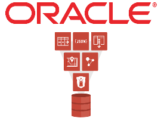
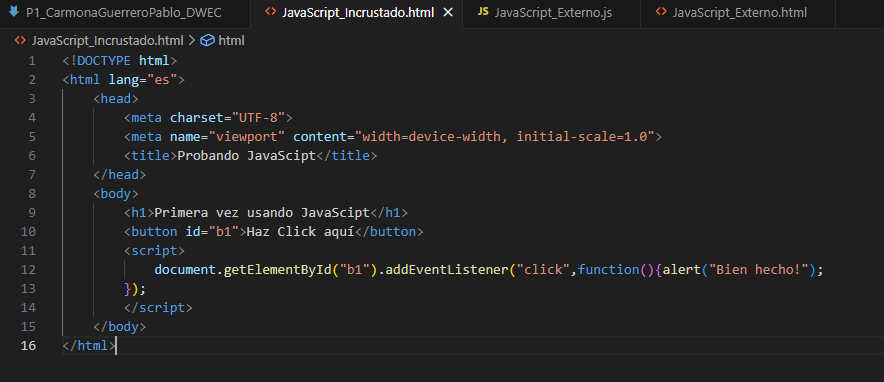
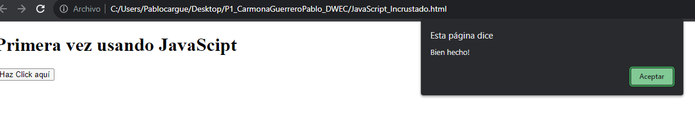
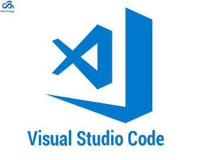

---
# **Proyecto 1**

---
# Índice

- Modelos de Programación en Entornos Cliente/Servidor
- Mecanismos de Ejecución de Código en un Navegador Web. Capacidades y Limitaciones de Ejecución. Compatibilidad con Navegadores Web
- Lenguajes de Programación en Entorno Cliente
- Características de los Lenguajes de Script. Ventajas y Desventajas
- Tecnologías y Lenguajes Asociados. Integración del Código con las Etiquetas HTML
- Herramientas de Programación

---
## Modelos de Programación en Entornos Cliente/Servidor

### Investigación de los modelos cliente/servidor más comunes

Arquitecturas cliente/servidor :

- Arquitectura de 2 Capas
- Arquitectura de 3 Capas
- Arquitectura de N Capas
  

---

## Modelos de Programación en Entornos Cliente/Servidor

### Identificación de ejemplos de aplicaciones que utilizan cada modelo

Arquitectura de 2 capas : 

Arquitectura de 3 capas :

Arquitectura de N capas :

---
## Mecanismos de Ejecución de Código en un Navegador Web. Capacidades y Limitaciones de Ejecución. Compatibilidad con Navegadores Web

### Estudio de cómo se ejecuta el código JavaScript en un navegador
- Descarga y carga del código
- Análisis léxico y sintáctico
- Creación del árbol de análisis
- Interpretación línea por línea
- Manipulación del DOM y eventos
- Ciclo de eventos
### Evaluación de las diferencias de compatibilidad entre navegadores
- Motor de renderizado
- Estándares web
- CSS y estilos
- Sistemas Operativos
- Resolución de la pantalla 

---
## Mecanismos de Ejecución de Código en un Navegador Web. Capacidades y Limitaciones de Ejecución. Compatibilidad con Navegadores Web

### Resolución de problemas de compatibilidad en una aplicación web

1. Identificación de problemas
2. REcopilación de información
3. Identificación de causas
4. REsolución de problemas

---

## Lenguajes de Programación en Entorno Cliente

### Investigación de lenguajes como JavaScript, TypeScript, y otros

---

## Lenguajes de Programación en Entorno Cliente

### Comparación de sus características y aplicaciones

---

## Características de los Lenguajes de Script. Ventajas y Desventajas

Ventajas : 

- Sencillo
- Simples
- Menor número de líneas
- Gran variedad de bibliotecas
- Interpretación en tiempo real

Desventajas : 

- Lentos de rendimiento
- Limitaciones en aplicaciones de alto rendimiento
- Ineficiencia en la gestión de la memoria
- Mejores opciones

---

## Tecnologías y Lenguajes Asociados. Integración del Código con las Etiquetas HTML

---

## Tecnologías y Lenguajes Asociados. Integración del Código con las Etiquetas HTML

---

## Herramientas de Programación

Aspectos :

- Complejidad
- Seguridad
- Escalabilidad
- Costo
- Lenguajes de programación
- Soporte de plataforma

Propósitos : 

- Editores de código
- Herramientas de desarrollo de navegador
- Software de prototipos web
- Gestoresd e paquetes
- Sistemas de control de versiones
- Ejecutores de tareas
- Herramientas de prueba de API
- Biblioteca de JavaScript
- Software de gestión de contenedores
- Preprocesadores CSS
- Servidores Web

---

## Herramientas de Programación

